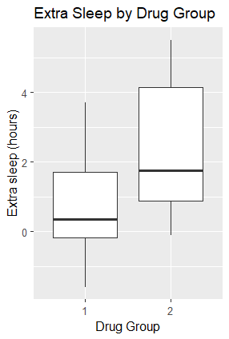
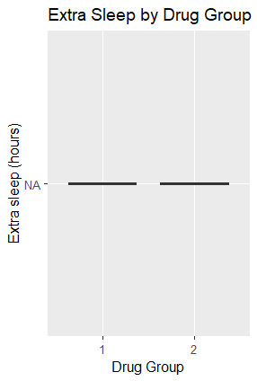

:::::::::::::::::::::::::::::::::::::: questions 

- What is a project environment and why does it matter?
- How can we create project environment?

::::::::::::::::::::::::::::::::::::::::::::::::

::::::::::::::::::::::::::::::::::::: objectives

- Explain the purpose of an project environment.
- Create a project environment using `renv`.
- Use use `renv::snapshot()` to take implicit and explicit snapshots of the environment.
- Restore an environment using a lockfile or using a `DESCRIPTION` file.

::::::::::::::::::::::::::::::::::::::::::::::::

## Running someone else's script

A colleague emails you an R script called `sleep_analysis.R` and asks you to reproduce their results while they are away.

Before running anything, set up a project environment to isolate your work.

### Create an R project

Before working with the script, create an R project in RStudio:
- Go to File > New Project > New Directory > New Project
- Name the directory `rworkshop`
- Create as a subdirectory of your home directory (for example: `C:/Users/username/`)
- Click "Create Project"
 
If you want to come back to your work later, open the R Project file you created (`rworkshop.Rproj`). Double‑clicking this file launches RStudio, sets the working directory, and restores your project as you left it.

### Save the script

Create a new R script called `sleep_analysis.R` inside the `rworkshop` folder and save the file after pasting in the code your colleague sent you:

``` R
library(obscurepackage)
library(ggplot2)

data <- sleep
none_transformed_data <- none_transform(data$extra)

p <- ggplot(data, aes(x = group, y = none_transformed_data)) +
  geom_boxplot() +
  labs(
    title = "Extra Sleep by Drug Group",
    x = "Drug Group",
    y = "Extra sleep (hours)"
  )

print(p)
```

### Run the script

Run `sleep_analysis.R` to see what happens.

In RStudio, you can run the script using your editor’s "Source" button.

You will probably hit an error resulting in a message that looks like the one below.

``` R
Error in library(obscurepackage) : 
  there is no package called ‘obscurepackage’
```

The script tries to load:
``` R
library(obscurepackage)
```

On your machine, R looks for packages in your global environment. You might already have `ggplot2` installed, but you probably don not have `obscurepackage` installed, so the script fails.

### Install the required packages

You may already have `ggplot2` installed, but if not, you can install it with:

```r
install.packages("ggplot2")
```

The `obscurepackage` is not on CRAN. You need to install it from GitHub:
``` R
remotes::install_github("stellaprins/obscurepackage")
```

::::::::::::::::::::::::::::::::::::: challenge
## Reproduce the results

Now that you have installed the required packages, are you able to reproduce the plot below? Why?

{alt="your colleague's sleep analysis plot" width='50%'}

:::::::::::::::::::::::: solution

## Show me the solution

The newest version of `obscurepackage` contains a bug that causes `none_transform()` to always return `NA`, so the boxplot cannot be reproduced unless you install the earlier version.

{alt="your sleep analysis plot" width='50%'}

:::::::::::::::::::::::::::::::::

::::::::::::::::::::::::::::::::::::::::::::::::

## Project environments

A version mismatch happens when your script relies on a package whose behaviour has changed between releases. This can be due to new features, altered defaults, or bugs, and causes the same code to produce different results.

A project environment prevents this by isolating the packages your project uses and recording their exact versions. This keeps your work separate from whatever happens to be installed globally on your system and avoids conflicts between R projects that require different or incompatible dependencies.

Installing packages inside a project environment also ensures that the same setup can be rebuilt, for example when someone else needs to run your analysis or you return to the project in the future.

::::::::::::::::::::::::::::::::::::: callout

## Two different meanings of environment in R

**1) project environments**  
These are project‑specific libraries created by the `renv` package.  They store packages and their versions, making your project reproducible on any machine.

**2) R environments**  
These store variables and track where functions were created, and control how R finds values. They enable features like lexical scoping and namespaces.

::::::::::::::::::::::::::::::::::::::::::::::::

In this workshop, we are going to use an R package called `renv` to manage our project environment.

To install `renv`
``` R 
install.packages("renv")
```

::::::::::::::::::::::::::::::::::::: challenge

## Find out more about `renv`

Use the R console to learn more about `renv`.
``` R
?renv
```

Explore the help page and useful links.

Summarise what `renv` is and and how it helps with project handovers.

:::::::::::::::::::::::: solution

## Show me the solution

`renv` is an R package that helps create reproducible environments. `renv` gives every R project its own library of packages, separate from everything else on your computer, and records the exact package versions the project uses.

When you hand a project to someone else `renv` ensures they can recreate your exact environment with one command. This ensures the code runs the same way for the next person as it did for the person handing over de project.

:::::::::::::::::::::::::::::::::

::::::::::::::::::::::::::::::::::::::::::::::::

Initialise `renv`:

``` R
renv::init()
```

This will:
- Set up project infrastructure inside your working directory that ensures `renv` will be used in future sessions
- Discover the packages that are currently installed, and install them into the project library folder where `renv` puts the packages that this project uses
- Create a "lockfile" named `renv.locks` that records the exact state of the project library
- Restart R.

### Install packages in the project environment

Before using `renv`, we installed packages using `install.packages(")`. This adds the package to the global R library that every project on the machine has access to. 

Any package you install into your `renv` will be kept isolated from whatever is installed globally on your machine.

Use `renv::install()` to install `ggplot2` directly into the `renv` environment:

``` r
renv::install("ggplot2")
```

This installs `ggplot2` only into the project’s `renv` library, leaving the global library untouched.

::::::::::::::::::::::::::::::::::::: challenge
## Install a GitHub package using `renv`

Use the help page for `renv::install` to learn how to install packages inside the `renv` environment.
``` R
?renv::install
```

- Use the help page to find out how to install a package from GitHub using `renv::install()`
- Use what you learned to install `v0.1.0` of the GitHub repository `stellaprins/obscurepackage`.

:::::::::::::::::::::::: solution

## Show me the solution

From the help page, GitHub packages can be installed by using the `username/repository` string, and specific versions can be installed by supplying a commit SHA.

The commit SHA for `v0.1.0` of `stellaprins/obscurepackage` is `9e7cfcba9bfbfd1cbea4dbc1600f8d5283c71831`.


```R
renv::install("stellaprins/obscurepackage@9e7cfcba9bfbfd1cbea4dbc1600f8d5283c71831")
```

:::::::::::::::::::::::::::::::::

::::::::::::::::::::::::::::::::::::::::::::::::

### Install obscurepackage from GitHub

To install a specific version of a GitHub package inside an `renv` project, use `the username/repo@version` format:

```R
renv::install("stellaprins/obscurepackage@v0.1.0")
```

Restart RStudio and rerun the `sleep_analysis.R` script.

You should be able to replicate the results of your colleague!

## Checking the environment with `renv::status()`

To check whether your project environment is consistent with your lockfile, use:
``` r
renv::status()
```

`renv::status()` compares three things:
- `renv` project library
- the `renv.lock` file
- What your project actually uses

If these differ, `renv::status()` will report inconsistencies such as:
- packages installed but not recorded
- packages recorded but not installed
- packages where the installed version ≠ recorded version
- a different R version than the one used to generate the lockfile

::::::::::::::::::::::::::::::::::::: challenge

## Fix `renv` status inconsistencies
Run:

``` r
renv::status()
```

Look at the output.

Now take a "snapshot using `renv::snapshot()`":
```r 
renv::snapshot()
```

Then, run `renv::status` again :

``` r
renv::status()
```

Compare the `renv::status` outputs before and after taking a snapshot:
- Which inconsistencies disappeared?
- Which (if any) remain?
- Why did snapshotting fix these issues?

:::::::::::::::::::::::: solution

## Show me the solution

After running `renv::snapshot()` the second time, you will (hopefully!) see something like
``` r 
No issues found -- the project is in a consistent state.
```

All of the inconsistencies should have disappeared because `renv::snapshot()` rewrites the lockfile to reflect the current state of your project library and R version.

:::::::::::::::::::::::::::::::::

::::::::::::::::::::::::::::::::::::::::::::::::

## Snapshots

Use `renv::snapshot()` to update a lockfile with the current state of dependencies in the project library. 

``` R
renv::snapshot()
```

Later, you or a collaborator can use it to recreate the same environment with:

``` R
renv::restore()

```

Use `renv::restore()` when:
- you open a project on a new computer
- you clone someone else's project from GitHub
- you want to return to a known working state


## `DESCRIPTION`

You receive an email from your colleague. Apparently the earlier file (`sleep_analysis.R`) was the wrong one.

This time, they sent two files:
    `sleep_analysis.R`
    `DESCRIPTION`


Download the `DESCRIPTION` file, and place it in your `rworkshop` folder.

Replace the contents of your existing `sleep_analysis.R` with the new script below, then save the file.

``` R
library(dplyr)
library(ggplot2)
library(broom)

data <- sleep

# Compute group means for bar plot
summary_tbl <- data |>
  group_by(group) |>
  summarise(
    mean_extra = mean(extra),
    sd_extra   = sd(extra),
    n          = n(),
    se_extra   = sd_extra / sqrt(n)
  )

# Compute prolongation (drug - placebo) per subject
sleep1 <- data |>
  group_by(ID) |>
  summarise(
    prolongation = extra[group == 2] - extra[group == 1]
  )

# Paired t-test
tt <- t.test(sleep1$prolongation, mu = 0)
tt_tidy <- tidy(tt)

p_value <- signif(tt_tidy$p.value, 3)
t_stat  <- signif(tt_tidy$statistic, 3)

# Bar plot with t-test annotation
ggplot(summary_tbl, aes(x = factor(group), y = mean_extra)) +
  geom_col(fill = "steelblue", alpha = 0.8, width = 0.6) +
  geom_errorbar(aes(ymin = mean_extra - se_extra,
                    ymax = mean_extra + se_extra),
                width = 0.2, linewidth = 0.8) +
  labs(
    title = "Extra Sleep by Drug",
    x = "Drug",
    y = "Extra Sleep (hours)"
  ) +
  annotate(
    "text",
    x = 1.5,
    y = max(summary_tbl$mean_extra) + 1,
    label = paste0("t = ", t_stat, "\n",
                   "p = ", p_value),
    size = 5,
    hjust = 0.5
  ) +
  theme_minimal(base_size = 14)
```

:::::::::::::::::::::::: challenge

## Learn more about `DESCRIPTION` files

Open the `DESCRIPTION` file in RStudio. What information does the file contain?

:::::::::::::::::::::::: solution

## Show me the solution

This particular `DESCRIPTION` contains one field, `Imports`, which lists the project’s dependencies and the minimum required version for each package.

``` R
Imports:
    dplyr (>= 1.1.0),
    tidyr (>= 1.3.0),
    ggplot2 (>= 3.4.0),
    broom (>= 0.8.0)

```
:::::::::::::::::::::::::::::::::

::::::::::::::::::::::::::::::::::::::::::::::::

### Reset the environment

First make sure `ggplot2` and `obscurepackage` are removed from the global R library.
``` R
remove.packages("ggplot2")
remove.packages("obscurepackage")
```

Then remove the `renv` project library and lockfile, and restart R.
``` R
unlink("renv/library", recursive = TRUE)   
unlink("renv.lock")                        
.rs.restartR()                             
```

Now you are back in the same situation as before setting up the environment.

Because `ggplot2` is definitely removed from the global library, you can test whether `renv` correctly installs everything based on the `DESCRIPTION` file.

Try running `sleep_analysis.R`. It should fail with an error. The script cannot run until `renv` installs the required packages.

## Find R package dependencies in a project

Before installing anything, it is useful to check which dependencies `renv` detects.

`renv::dependencies()` scans your project files and reports every package it finds, along with where each one came from. 

``` R
renv::dependencies()
```

:::::::::::::::::::::::: challenge

## `renv::dependencies()`
Run `renv::dependencies()`:

``` R
renv::dependencies()
```
What packages does `renv` detect, and where does it say they come from?

:::::::::::::::::::::::: solution

## Show me the solution

`renv` detects packages listed in the `DESCRIPTION` file [here](files\02-environments\DESCRIPTION) and `sleep_analysis.R`.

The `Source` column shows the exact file where each dependency was detected.

:::::::::::::::::::::::::::::::::

::::::::::::::::::::::::::::::::::::::::::::::::

## Install dependencies from `DESCRIPTION` file

Use `renv::install()` to install all packages in the`Imports` field.
``` R
renv::install()
```

This installs the packages that are listed in the `DESCRIPTION` file.

::::::::::::::::::::::::::::::::::::: callout

The `DESCRIPTION` file usually specifies minimum required versions, not exact pins.

This flexibility allows newer, compatible versions to be installed so your project can benefit from bug fixes, performance improvements, and security updates.

In contrast, the lockfile records the exact package versions used in a specific environment.

This means your colleague’s lockfile may differ from yours even if you share the same `DESCRIPTION` file.

::::::::::::::::::::::::::::::::::::::::::::::::

Now that the dependencies are installed inside the project environment, rerun your analysis:
``` R
source("sleep_analysis.R")
```
The script should now run without errors, because every required package is available inside the `renv` project library.

## Explicit snapshot

Because you deleted the lockfile earlier, `renv` currently has no record of the environment you just rebuilt.

If you check:
``` R
renv::status()
```
`renv` will report the lockfile as missing.

To fix this, take an **explicit snapshot**.

``` R
renv::snapshot(type = "explicit")
```

:::::::::::::::::::::::: challenge

## Snapshot types

Use the help system to find out what snapshot types are available and how they differ:
``` R
?renv::snapshot
```
What is the default snapshot type when calling `renv::snapshot()`?
How do implicit and explicit snapshots differ?
Why is an explicit snapshot the better choice in this situation?

:::::::::::::::::::::::: solution

## Show me the solution

The default snapshot type is implicit.

An **implicit snapshot** only records packages that `renv` detects as used in your R scripts.
An **explicit snapshot** only records packages listed in the `DESCRIPTION` file.

An explicit snapshot is preferable because it restores the lockfile based solely on the `DESCRIPTION` file and avoids the risk of `renv` adding packages that show up in any "stray scripts" and are not meant to be part of the environment.

:::::::::::::::::::::::::::::::::

::::::::::::::::::::::::::::::::::::::::::::::::

After taking the explicit snapshot, confirm that the project is now consistent.
``` R
renv::status()
```
You should see a message indicating that there are no issues.

::::::::::::::::::::::::::::::::::::: keypoints

- An **R environment** defines the exact versions of R and packages used in a project.
- `renv` creates isolated, project‑specific libraries for reproducible workflows.
- Reproducibility depends on stable, well‑defined environments.

::::::::::::::::::::::::::::::::::::::::::::::::
